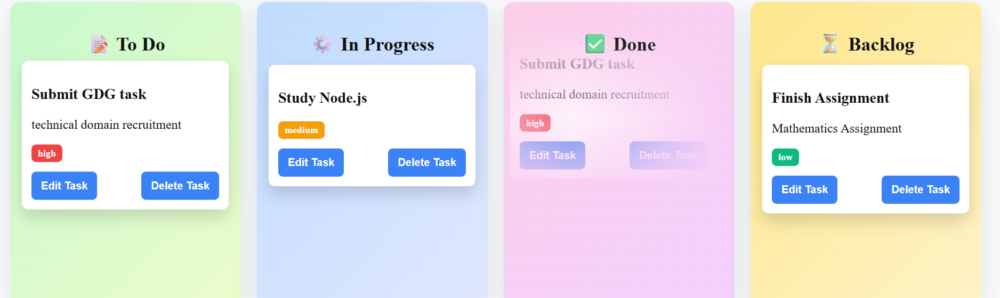
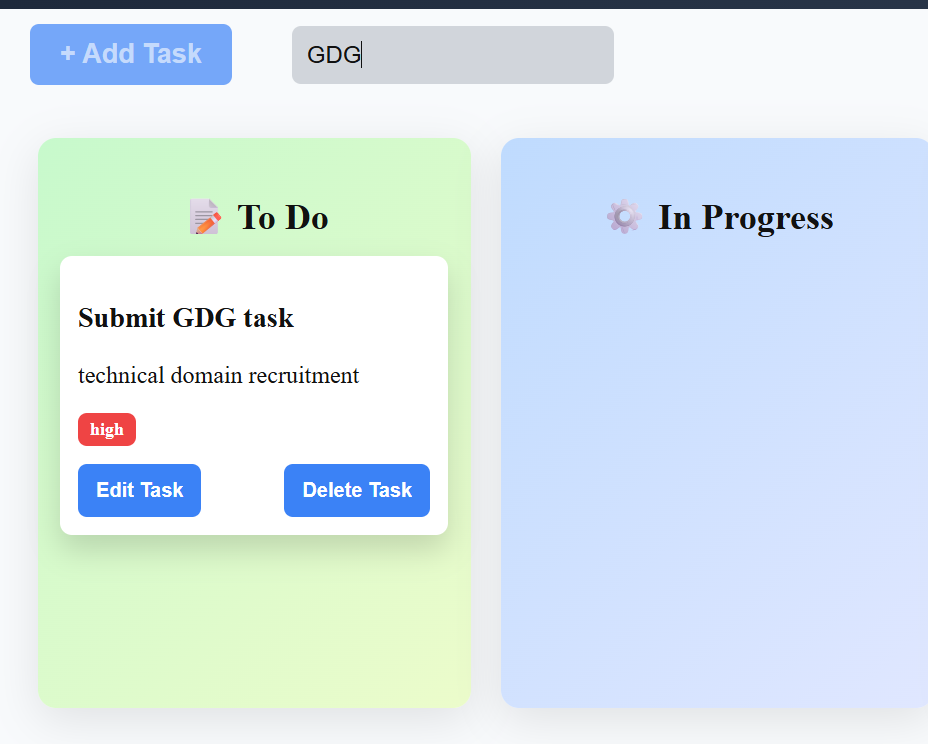
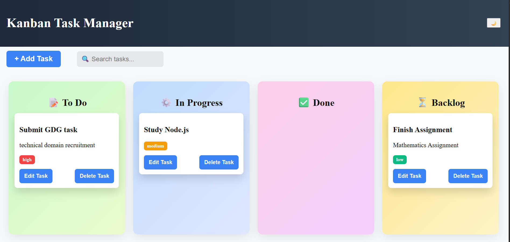

# Kanban Task Manager

🔗 **Live Demo:** https://kanban-board-lilac-kappa.vercel.app/

---

## Preview

---

## About the Project

This is a simple **Kanban-style task management application** built using **React**.
It allows users to organize tasks across different stages such as **To Do**, **In Progress**, **Done**, and **Backlog**.

The project focuses on learning **React state management, reusable components, drag-and-drop interactions, and browser storage**.

---

## Features

* Add tasks with title, description, and priority
* Edit and delete tasks
* Drag and drop tasks between columns
* Search tasks by title or description
* Priority levels (**Low**, **Medium**, **High**)
* Data persistence using **LocalStorage**
* Responsive Kanban board layout

---

## Tech Stack

* **React**
* **JavaScript (ES6)**
* **CSS**
* **Vite**

---

## Screenshots

### Kanban Board

### Add Task

### Drag and Drop

### Search Tasks

### Task Priority

---

## Installation

Clone the repository:

git clone https://github.com/your-username/kanban-project.git

Navigate into the project folder:

cd kanban-project

Install dependencies:

npm install

Run the development server:

npm run dev

---

## Notes

* Drag-and-drop functionality is optimized for **desktop browsers**.
* Tasks are saved using **browser LocalStorage**, so they persist after page refresh.

---

## Author

Khushi
