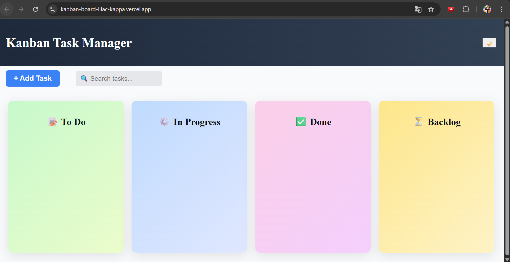
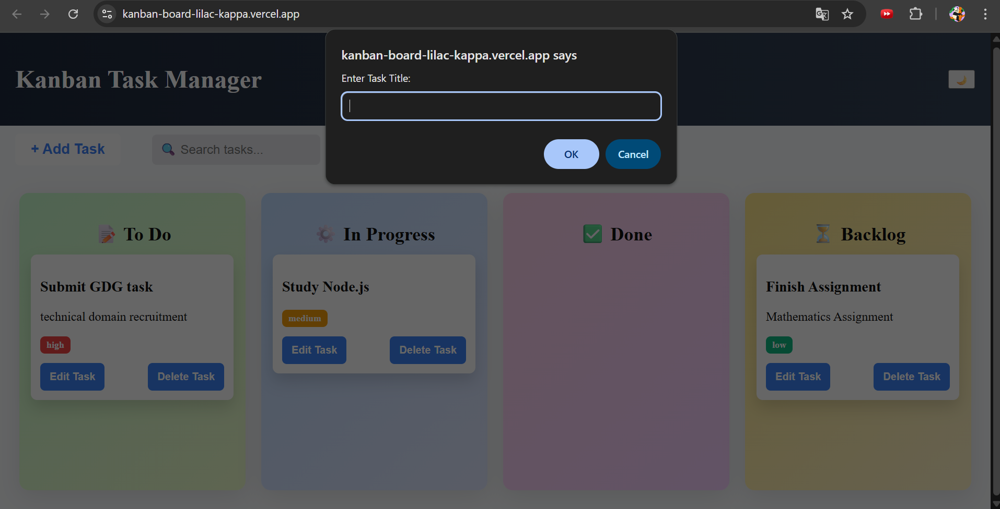

# Kanban Task Manager

A simple Kanban-style task manager built using React. This application allows users to organize tasks across different stages such as **To Do**, **In Progress**, **Done**, and **Backlog**.

## Live Demo

https://kanban-board-lilac-kappa.vercel.app/

## Features

* Add tasks with title, description, and priority
* Edit and delete tasks
* Drag and drop tasks between columns
* Search tasks by title or description
* Priority levels (Low, Medium, High)
* Data persistence using browser LocalStorage

## Tech Stack

* React
* JavaScript
* CSS
* Vite

## Screenshots

### Kanban Board

### Add Task

### Drag and Drop

### Search Tasks

## Installation

Clone the repository:

git clone https://github.com/your-username/kanban-project.git

Navigate to the project folder:

cd kanban-project

Install dependencies:

npm install

Run the development server:

npm run dev

## Author

Khushi
